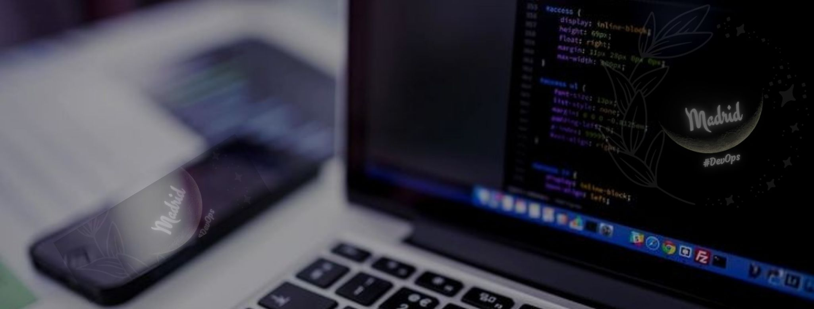
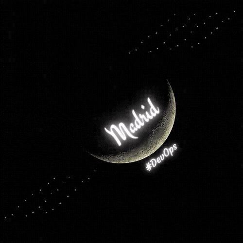

  

# 👋 Hello Moon !  

Developer :shipit: | Romantic red bone :revolving_hearts: | Curious :eyes: :headphones: | Angry (sometimes) but Chida :poop: :stuck_out_tongue_closed_eyes:

I'm computer systems engineer who contributed to the development of functionalities of different Web platforms, optimistic about the challenges of new projects, collaborating by contributing ideas and solutions, I believe a lot in teamwork, in the sharing of acquired knowledge as well as its experiences . I try to adapt quickly and be a manager of continuous improvement.

<!--
**MadriD2ev/MadriD2ev** is a ✨ _special_ ✨ repository because its `README.md` (this file) appears on your GitHub profile.

Here are some ideas to get you started:

- 🔭 I’m currently working on ...
- 🌱 I’m currently learning ...
- 👯 I’m looking to collaborate on ...
- 🤔 I’m looking for help with ...
- 💬 Ask me about ...
- 📫 How to reach me: ...
- 😄 Pronouns: ...
- ⚡ Fun fact: ...
-->
